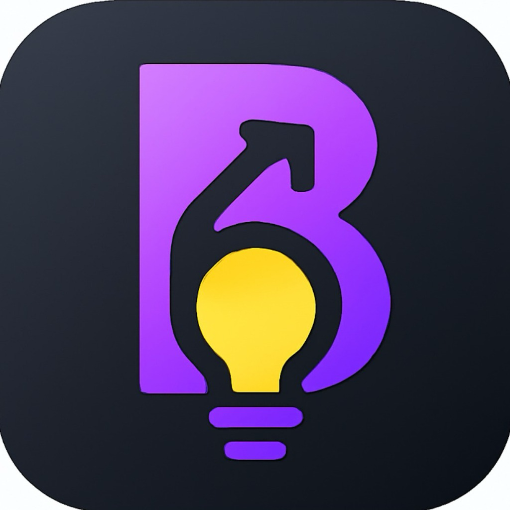

<div align="center">
  
  <h1>BetterSelf</h1>
  <p><strong>Capture, recall, and apply what matters — so your learning compounds every day.</strong></p>

  [](https://apps.apple.com/ch/app/betterself/id6752654530)
  [](https://developer.apple.com/ios/)
  [](https://swift.org/)
</div>

---

**BetterSelf** is an iOS app that helps you capture, organize, and revisit the lessons, insights, and ideas that shape who you are. Keep your reminders private, pinned, and easily accessible anytime. Never forget the moments that matter — have your ideas, memories, and inspirations all in one place.

The app surfaces your insights back to you daily using the **FSRS spaced repetition algorithm**, so what you learn actually sticks long-term.

---

## Screenshots

> *Add your App Store screenshots here*

---

## What It Does

BetterSelf lets you save insights in three formats:

- **Video** — record a short clip or link a YouTube video to remember a moment, lecture, or talk
- **Photo** — capture an image that carries a memory or lesson
- **Text** — write a reflection, quote, or note, with an optional link to an article or book

These insights live in organized **Folders** (with optional Face ID locking) and are surfaced back to you through **The Lab**, a vertical scrolling feed powered by the FSRS spaced repetition algorithm. The feed shows you what's due for review each day, keeping your most important learnings fresh without overwhelming you.

---

## Features

**The Lab** — A TikTok-style daily feed driven by spaced repetition. The app schedules when each insight should reappear based on how well you know it, maximizing long-term retention.

**Insights** — Folder-based library for all your reminders. Sort by date, pin favorites, and protect sensitive folders with Face ID.

**Sharing** — Share any insight with a link (`bettermyself.app/share/...`). Others can open the link and save the insight directly into their own BetterSelf. The Share Extension lets you save URLs from Safari or any other app without leaving it.

**Home Screen Widget** — A small widget that displays your pinned insights so they're always visible on your home screen.

**Daily Notifications** — The app schedules a week of notifications at a time, surfacing pinned or recent insights to keep you engaged with your learnings.

**Themes & App Icons** — Choose from multiple color themes and alternate app icons to make the app feel like yours.

---

## Tech Stack

| Layer | Technology |
|---|---|
| UI | SwiftUI |
| Local persistence | SwiftData |
| Spaced repetition | [FSRS](https://github.com/open-spaced-repetition/swift-fsrs) |
| Cloud storage | Firebase Storage |
| Sharing backend | Firebase Firestore |
| Authentication | Firebase Auth (anonymous) |
| Analytics | Firebase Analytics |
| Widget | WidgetKit |
| Share extension | UIKit Share Extension |
| Deep linking | Universal Links + Custom URL Scheme |

---

## Project Structure

```
BetterSelf/
├── BetterSelf/                  # Main app target
│   ├── Main App/                # App entry point, ContentView, NotificationManager
│   ├── Feed/                    # The Lab — FSRS-powered daily feed
│   ├── HomeView/                # Home screen components
│   ├── ReminderView/            # Reminder display (video, photo, text, article)
│   ├── AddReminder/             # Reminder creation flow
│   ├── Folder/                  # Folder management and list views
│   ├── LinksHandling/           # YouTube, Instagram, TikTok, and article viewers
│   ├── Welcome/                 # Onboarding flow and tutorial system
│   ├── Settings/                # Theme, appearance, and app icon settings
│   ├── Services/                # Firebase, media upload, reminder logic
│   ├── Navigation/              # App-wide navigation state (AppFlow)
│   ├── ProblemSolver/           # AI insight matching (in development)
│   └── Utils/                   # Shared UI components, colors, utilities
├── BetterSelfWidget/            # WidgetKit extension
└── BetterSelfSharing/           # Share extension for saving URLs from other apps
```

---

## Requirements

- iOS 17.0+
- Xcode 16.0+
- A Firebase project with Storage, Firestore, and Auth enabled
- A `GoogleService-Info.plist` placed in the `BetterSelf/` target folder (not included in this repo)

---

## Getting Started

1. Clone the repository
2. Add your `GoogleService-Info.plist` to `BetterSelf/BetterSelf/`
3. Open `BetterSelf.xcodeproj` in Xcode
4. Select your development team in the project signing settings
5. Build and run on a simulator or device running iOS 17+

> The app uses anonymous Firebase Auth sign-in on launch. No account creation is required from the user.

---

## License

This project is source-available for reference and learning purposes. All rights reserved.
